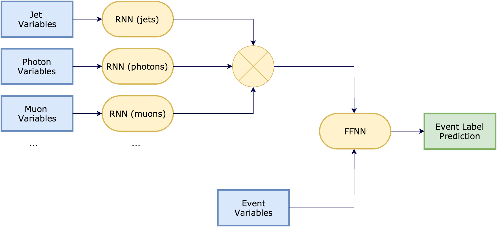

# hh2yybb Event Classifier
Event level classifier for the hh-->yybb analysis using multi-stream RNNs

## RNN-based Event Level Classifier for ATLAS Analysis (hh-->yybb) 
 
### Purpose: 
'Cut-based' methods are the prevalent data analysis strategy in ATLAS, which is also currently being used in the hh-->yybb analysis group. To improve on this, a ML algorithm is being trained to select the correct “second b jet” in single-tagged events ([bbyy jet classifier](https://github.com/jemrobinson/bbyy_jet_classifier)). The project in this repo will take this a step further and develop an event classifier. 
 
### Current Status:

### Deep Learning Module:

Our goal is to train an event-level classifier, in order to be able to distinguish di-Higgs resonant decays from photons+jets backgrounds. To describe an event, we combine the pre-calculated event-level information with a series of RNN streams that extract information about the event from the properties of the different types of particles in it (jets, electrons, photons, muons, ...).

We phrase our project both as a classification and a regression. In the classification task, we consider every mass hypothesis for the di-Higgs parent particle as a separate class, and we attempt to solve a multi-class classification problem. In the regression task, we use the nominal mass of the parent particle as the continuous variable to predict.

### To-do list:
 1. Testing module to check performance and produce ROC curves. Plot ROC curve as a function of mu (pile-up), pt of largest jet, Njets, etc. 

---
This project has been assigned to [@gstark12](https://github.com/gstark12) and [@jennyailin](https://github.com/jennyailin) as part of their Summer 2016 internship at CERN. They will work under the supervision of [@mickypaganini](https://github.com/mickypaganini) and Prof. Paul Tipton.
